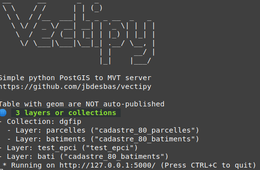

# Vectipy

Simple [Mapbox Vector Tiles (MVT)](https://docs.mapbox.com/vector-tiles/reference/) server with Flask and PostGIS.

MVT are a simple and conveniant way to share geodata using webmap or GIS software.

For webmap : instead GeoJson file, MVT are loaded _on the fly_, so you can easly add maplayer with hundreds of geometry. Geometry are generalized in higher zoom.
For QGIS software : Recents releases of [QGIS](http://qgis.org) natively support MVT, which can be used like WFS.

## Quickstart

⚠️ You need a fonctionnal PostGIS (>2.4) base.

Clone the repo, create a virtual python environment and install requierements

```bash
git clone git@github.com:jbdesbas/vectipy.git

cd vectipy

virtualenv -p python3 venv

source venv/bin/activate

pip install -r requierements.txt

```

Create a _.env_ file with your credentials or export them

```bash
export PG_HOST=my_db_host
export PG_PORT=5432
export PG_DATABASE=my_db_name
export PG_USER=my_db_user
export PG_PASSWORD=my_db_password
```

Enjoy !
```bash
python vectipy.py run -p 5000
```



Use following routes 
- http://localhost:5000/ Show availables layers
- http://localhost:5000/MY_LAYER.json TileJSON file
- http://localhost:5000/MY_LAYER/{z}/{x}/{y}.pbf Tiles endpoints
- http://localhost:5000/map/MY_LAYER Layer preview
- http://localhost:5000/map/MY_LAYER.geojson GeoJson file (for download or webmap)


Notes
- Add a **geometry index** on each layer greatly improve performances (`CREATE INDEX my_layer_geom_3857_idx ON my_layer USING GIST (ST_Transform(geom, 3857))` );
- Preview only avaible for constrained geometry type (see https://postgis.net/docs/using_postgis_dbmanagement.html#Manual_Register_Spatial_Column )
- Install [gunicorn](https://gunicorn.org/) (`pip install gunicorn`) and use `gunicorn vectipy:app` for production


## Configuration

Tables with a geometric column are automatically serverd by Vectipy. I suggest to disable this in _config.toml_ and explicitly configure layers that you want to serve.

### Layers definition

You can define _Layers_ or _Collections_ (multi-layers tiles)


```toml
[[collection]] #a multi-layers tileset
  name = "my_multilayers_tiles" #the collection name, used in tiles url
    [[collection.layer]]
      name = "first_layer" #layer name (published name, used for style definition)
      table_name = "table1" #database table name
      minzoom = 14 #OPTIONAL
      maxzoom = 20 #OPTIONAL
      columns = [ "id", "label"] #OPTIONAL published columns (default : all columns)

    [[collection.layer]]
      name = "second_layer"
      table_name = "table2"

[[layers]] #a single-layer tileset
  table_name = "my_single_layer"
  name = "my_table"
```

## Features :
- [x] Easy to deploy MVT (pbf) server
- [x] TileJson metadata
- [x] Frontend preview with [MapLibre GL](https://github.com/maplibre/maplibre-gl-js) 
- [x] Serve GeoJSON file
- [ ] Cache system
- [ ] OGC API Features (WFS 3) server https://www.ogc.org/standards/ogcapi-features


